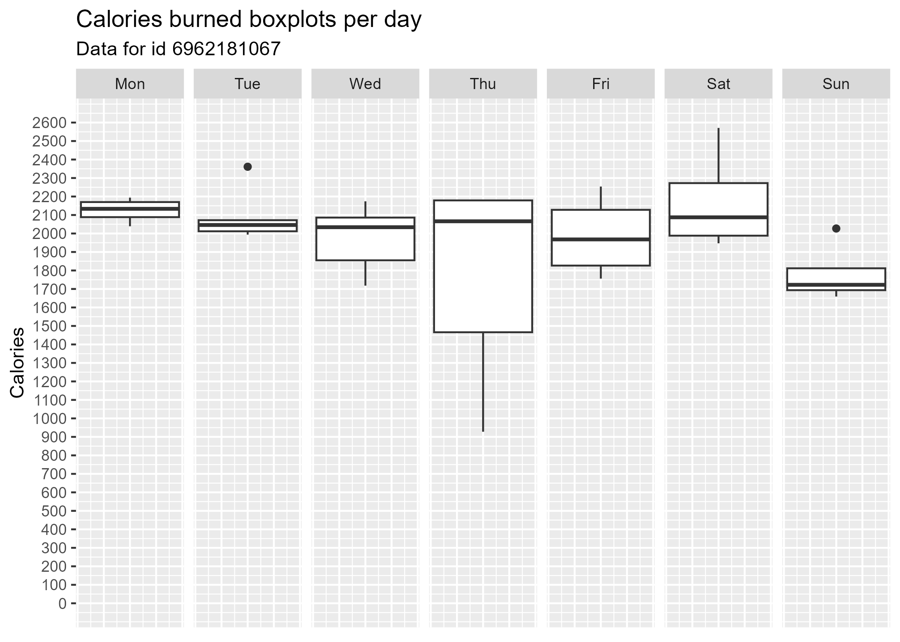
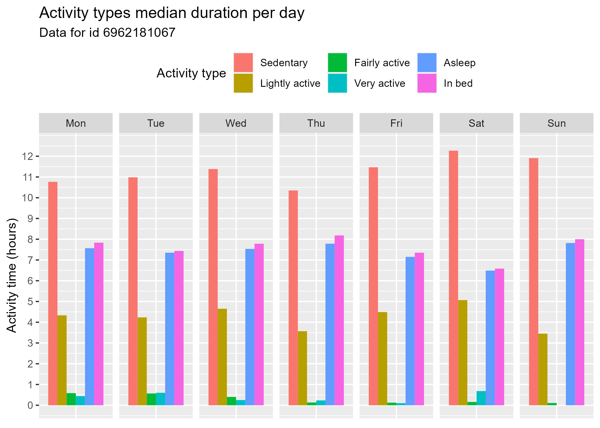
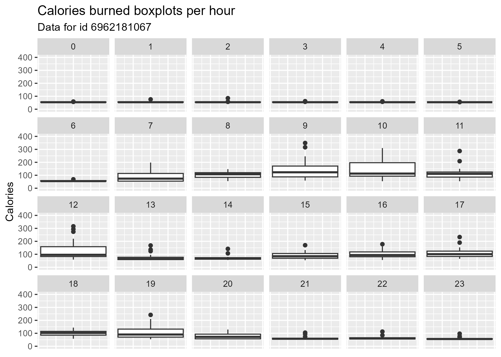
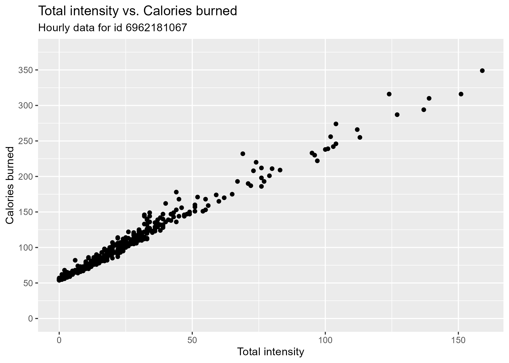
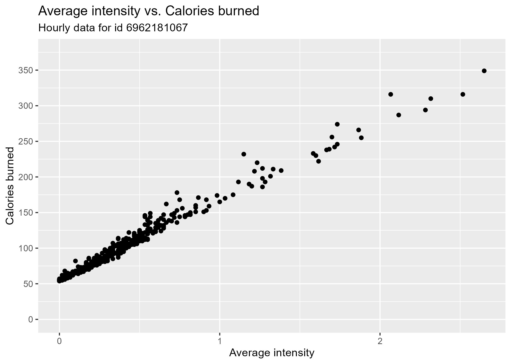
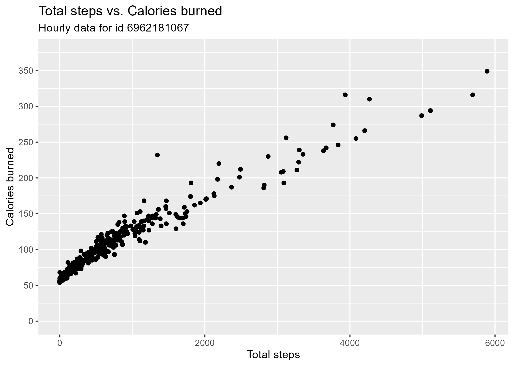
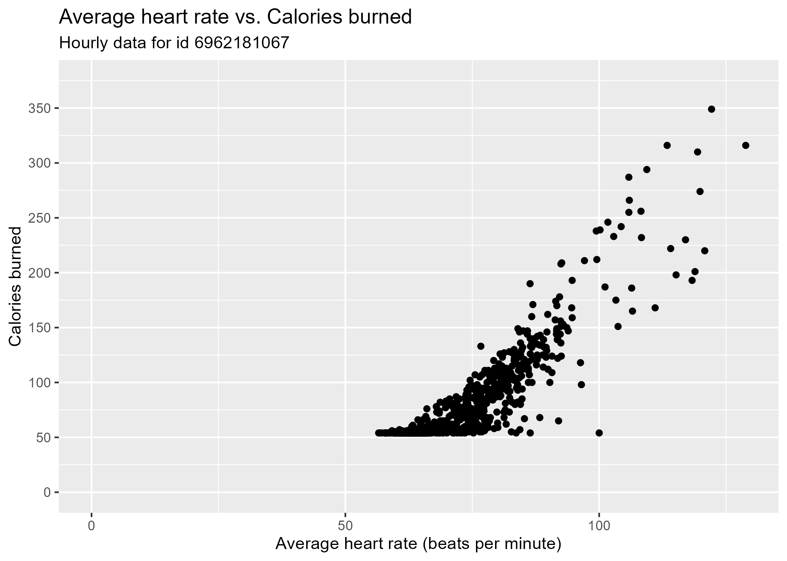
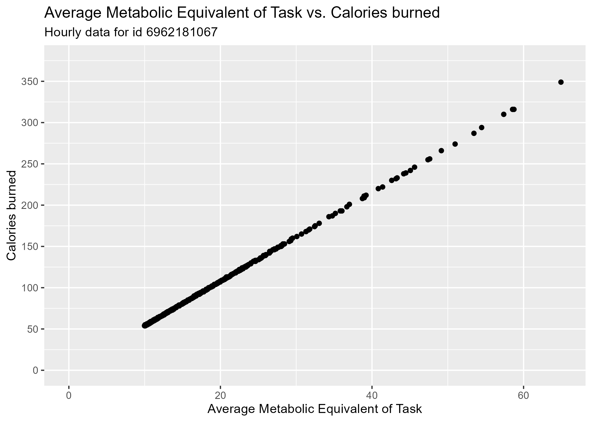

```{r setup, include=FALSE}
knitr::opts_chunk$set(echo = TRUE)
```

# License

The source code of this repository is licensed under the [GPL-3 license](LICENSE), and the images located in the **plots/** folder are licensed under the [Creative Commons Attribution 4.0 International license](https://creativecommons.org/licenses/by/4.0/legalcode).

# Overview

Analyze the selected Fitbit usage data in order to find ways to market on the insights discovered.

The **R packages requirements** are:

* rmarkdown (version **2.22**), licensed under the [GPL-3 license](https://github.com/rstudio/rmarkdown/blob/main/LICENSE.md). This package is used for generating the **README.md** file.
* tidyverse (version **2.0.0**), licensed under the  [MIT license](https://github.com/tidyverse/tidyverse/blob/main/LICENSE.md).

## Ask

The business question is the following: **How are people using their fitness smart devices?**.

## Prepare

Details of the selected data source [@Dataset]:

-   **Name:** mturkfitbit_export_4.12.16-5.12.16 (Fitabase Data 4.12.16-5.12.16)
-   **Location:** <https://zenodo.org/record/53894#.X9oeh3Uzaao>
-   **License:** [Creative Commons Attribution 4.0 International](https://creativecommons.org/licenses/by/4.0/legalcode)
-   **Structure:** The dataset is organized in 18 files with csv format. Each one has the following fields: Id, date (with ot without a time part) and a set of values related to the user physical state measured by a Fitbit device: steps, distance, activity, calories, pulse, intensity, Metabolic Equivalent of Task (MET), weight, fat and Body Mass Index (BMI). It is assumed that the Id field gives the possibility of linking records on different files.
-   **Data collection method:** A group of people surveyed through the Amazon Mechanical Turk plattform between the 12/03/2016 and 12/05/2016 (**DD-MM-YYYY**) gave their consent to send their personal tracker's data.

For simplicity only the data that goes from 12/04/2016 to 12/05/2016 (**DD-MM-YYYY**) was used.

The original dataset data should be saved in the folder **original-dataset/**. ***It should contain the 18 csv files***:

```{r Original dataset location definition}
dataset_dir_path <- "original-dataset"
```

## Process

The **cleaning process** consisted of the following:

-   From the 18 files that make the dataset the following were discarded:

    -   **dailyCalories_merged.csv**, **dailyIntensities_merged.csv** and **dailySteps_merged.csv** because their content is already found in the file **dailyActivity_merged.csv**.
    -   **minuteCaloriesNarrow_merged.csv**, **minuteIntensitiesNarrow_merged.csv**, **minuteStepsNarrow_merged.csv**, **minuteCaloriesWide_merged.csv**, **minuteIntensitiesWide_merged.csv** and **minuteStepsWide_merged.csv** because the recorded measurements show per minute and there are other files with measurements per hour. The latter were preferred due to presenting a smaller lever of detail.
    -   **minuteSleep_merged.csv** because it is not clear what the column **value** means, as it can be 1, 2 or 3. Initially it was thought that it could only be 0 or 1 due to the time differences of just 1 minute.

-   When loading the files the name of the column with the date/datetime value was changed to **Time** for standardization purposes.

-   Only were taken into account records associated with an **Id** value that shows in all of the non-discarded files, that is all files except those from the previous steps. With that in mind, the Id values that fulfill this requirement are **4558609924**, **5577150313** and **6962181067**. Nonetheless a couple were excluded because the number of records, it is 1 per day, in the file **weightLogInfo_merged.csv** is too small:

    -   **4558609924**: 5 records.
    -   **5577150313**: 1 record.

    On the other hand, the number of records for the Id **6962181067** is 30.

-   Only records with the **Id** value of **6962181067** and a date (**y-m-d**) included in the biggest common time interval of all non-discarded files are kept. That interval is 2016-04-12 to 2016-05-12.

-   The records left from the previous steps were combined to produce 2 files:

    -   **daily_data.csv**: is the combination of the files **dailyActivity_merged.csv**, **sleepDay_merged.csv** and **weightLogInfo_merged.csv** using the columns **Id** and **Time**. From the resulting dataframe the following columns were discarded:

        -   **Id**: it has only one value (**6962181067**).
        -   **TrackerDistance**: it is not clear what is the difference between this variable and **TotalDistance** (the values are the same except in 3 records, which are associated to the **Time** values of 2016-04-21, 2016-04-25 and 2016-05-09).
        -   **LoggedActivitiesDistance**: it is not clear what it means. Which are the logged activities and which are not?
        -   **TotalSleepRecords**: it is not clear what it means.
        -   **WeightPounds**: there is another column that records the weight in kilograms: **WeightKg**.
        -   **Fat**: all values are NA.
        -   **IsManualReport**: it has only one value: TRUE.
        -   **LogId**: it is not relevant.

    -   **hourly_data.csv**: is the combination of the files **hourlyCalories_merged.csv**, **hourlyIntensities_merged.csv**, **hourlySteps_merged.csv**, **heartrate_seconds_merged.csv** (data were aggregated by hour and the average heart rate was calculated) and **minuteMETsNarrow_merged.csv** (data were aggregated by hour and the average MET value was calculated), using the columns **Id** and **Time**. From the resulting dataframe the **Id** column was discarded because it has only one value: 6962181067.

The library **tidyverse** is used across this case study, and not only for the **cleaning process**:

```{r Load libraries, message=FALSE}
library("tidyverse")
```

The script **clean_data.R** generates the cleaned dataset in the folder **cleaned-dataset/**

```{r Clean data generation, message=FALSE}
source("utils/clean_data.R")

# Define folder paths
cleaned_dataset_dir_path <- "cleaned-dataset"

# Load dataset data
dataset_files_data <- load_dataset_files_data(dataset_dir_path, dataset_files_relevant_metadata)
#print_dataset_files_info(dataset_files_data)
#glimpse(dataset_files_data)
#glimpse(dataset_files_data[[18]])

# Check for missing values existence
#check_missing_values(dataset_files_data)

# Get unique Id values present in all dataset files
unique_Id_values_in_all_files <- get_Id_values_in_all_files(dataset_files_data)
#print(unique_Id_values_in_all_files)
# Unique Ids: 4558609924 5577150313 6962181067

# Filter the data so it only include the Ids specified
ids_to_exclude <- c("4558609924", "5577150313")
ids_to_keep <- unique_Id_values_in_all_files[!(unique_Id_values_in_all_files %in% ids_to_exclude)]
dataset_files_data <- keep_only_records_from_Ids(dataset_files_data, ids_to_keep)
#print_dataset_files_info(dataset_files_data)

# Get biggest common date range
biggest_common_date_range <- get_biggest_common_date_range(dataset_files_data)
#print(as_date(biggest_common_date_range))
#print(dataset_files_data[[8]], n = 100)

# Filter the data so it only include records in the specified date range
dataset_files_data <- keep_only_records_within_given_date_range(biggest_common_date_range, dataset_files_data)
#print_dataset_files_info(dataset_files_data)

# Create cleaned dataframes
joined_dataset_files_data <- join_dataset_files_data(dataset_files_data)
#print_dataset_files_info(joined_dataset_files_data, FALSE)
#check_missing_values(joined_dataset_files_data)

# Plot data to check outliers visually
#dest_folder_path <- "Capstone/plots/"
#plot_cleaned_data(joined_dataset_files_data, dest_folder_path)

# Save cleaned data
save_cleaned_data(joined_dataset_files_data, cleaned_dataset_dir_path)
```

## Analyze

Summary of the analysis developed:

-   The distributions of the calories burned for each day were analyzed. It was found that the median values of the calories burned are not very different when excluding Sunday: minimum value is 1968 and maximum value is 2133.5, so the range is just 165.5 calories. To get an idea, a 84 kg person burns 159 calories when walking at a speed of 3.5 mph for 30 minutes [@ActivitiesAndCalories].

-   The distributions of the calories burned for each hour were analyzed. It was found that the median values of the calories burned are not very different: minimum value is 54 and maximum value is 123, the range is just 69 calories. To get an idea, a 84 kg person burns 47 calories when reading for 30 minutes [@ActivitiesAndCalories]. On the other hand, no distribution includes a value of 0 calories and in fact the smallest value is 54 calories.

-   It was analyzed how it is distributed for each day the time invested in the following types of activities: **Sedentary**, **Lightly active**, **Fairly active**, **Very active**, **Asleep** and **In bed**. Using bar charts it was found that the median of the time invested in heavy activities (**Lightly active** and **Fairly active**) is less than 65 minutes for all days.

-   The following relationships were visualized in scatter plots:

    -   Total intensity vs. Calories burned.
    -   Average intensity vs. Calories burned.
    -   Total steps vs. Calories burned.
    -   Average heart rate vs. Calories burned.
    -   Average Metabolic Equivalent of Task (MET) vs. Calories burned.

    It was found using the plots that in each of the previous pairs of variables when increasing the **Total intensity** (**Average intensity**, **Total steps**, **Average heart rate** and **Average METs**) the **Calories burned** increase, on average. In particular the relationship between **Average METs** and **Calories burned** is pretty linear.

## Share

List of **key findings**:

-   Sleeping burns calories.
-   The median **Calories burned** for each day are not very different when excluding Sunday.
-   The median time invested on activities **fairly active** and **very active** for each day is maximum 64.2 minutes. Most active time is spent in either **sedentary** or **lightly active** activities.
-   The median **Calories burned** for each hour are not very different.
-   When **Total intensity** increases (**Average intensity**, **Total steps**, **Average heart rate** and **Average METs**) the amount of **Calories burned** increases.

The **support visualizations** are generated with the script **analyze_data.R** and saved in the folder **analysis/**:

```{r Analysis and visualization generation, message=FALSE}
source("utils/analyze_data.R")

# Load cleaned dataset data
dataset_files_data <- load_cleaned_dataset_files_data(cleaned_dataset_dir_path, cleaned_dataset_files_relevant_metadata)
#print_dataset_files_info(dataset_files_data, show_unique_id_values = FALSE)

# Define folder to save some transformed data and the visualizations
analysis_dir_path <- 'analysis'

# Perform analysis calculations
perform_analysis(dataset_files_data, analysis_dir_path)
```

These are the **visualizations**:


















## Act

**High-level insights:** The difference between the medians of the **Calories burned** when aggregating per day and hour can be useful data for the user to monitor the schedule of heavy physical activity, and hence determine if those have been done and how effective they have been.

# References
